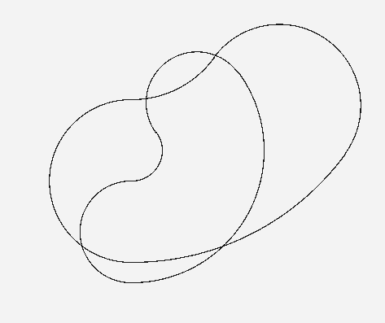
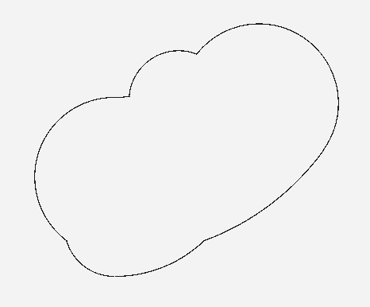

## 原理
圆的摆动轨迹由三到四个圆弧构成，外轮廓计算将相交的圆弧视为图，交点是图结点，圆弧是图的边，外轮廓视为对图的遍历

## 用法

```c++
#include "GeomUtils.h"

//构造轨迹
std::vector<ArcRect> rects;
ArcRect rec1(50, { 200,200 }, 80, -PI * 0.5, PI * 0.2);
rects.push_back(rec1);
ArcRect rec2(80, { 200,350 }, 180, -PI * 0.5, -PI * 0.2);
rects.push_back(rec2);
//计算
ArcRectOutlineCalc calc;
auto res = calc.CalcOutline(rects);
```

## 效果

